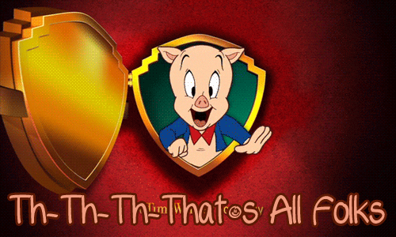

# Runaway

Runaway is a game designed to improve your ability to maintain the focus, during stressful situations, and increasing difficulty. This game was developed as part of my Web Development Bootcamp at IronHack Brazil.

## Acknowledgments

First of all, I would like to say thanks to all my colleagues, my teachers, and all IronHack staff for helping me achieve the goal of publishing my first game, it was a real challenge. Thanks for all the great moments that we shared.

## Getting Started

This game works at the browser and does not need any installation.

If you want to test it, just access the following link: https://ptdavid0.github.io/run-away-game/

## Game 

The game is ideal for developing your ability to stay focused for a short and stressful period. To play you only need your mouse or trackpad.

## How to play

- The idea of the game is to stay alive as long as possible. To do this, you must avoid the collision of the player who has a green color, with the enemies, that have variant color.
- The position of the player is established according to the movement of the mouse over the game screen.
- The game has three modes: Rabbit Party, SpeedRunners and Hydra.
To learn more about each of them, simply enter the game and hover over their selection buttons.
- The game score is the time you survived. To play again, just click one of the game modes buttons.
- To learn more, just log in and have fun

## Improvements

- Use object orientation.
- Add a game mode where the player becomes invisible after a few seconds and returns to its default state. This way, the player is always forced to record the player's position at any given moment.
- Add more comments.

## That's all folks!!!

